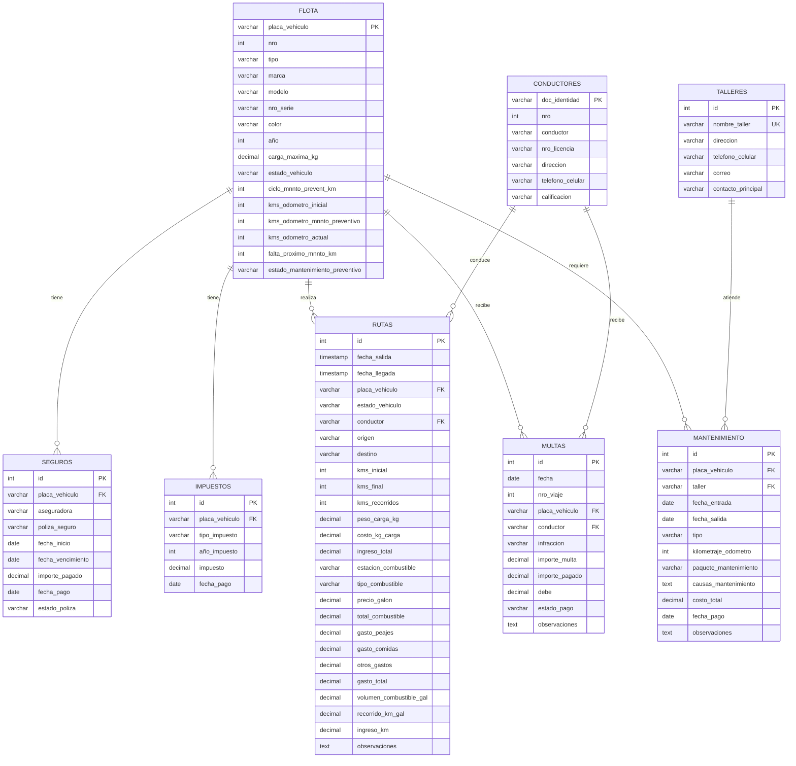

# Diagrama ERD - Formato Mermaid

## Diagrama de Entidad-Relación



## Resumen Visual de Relaciones

```
                    ┌─────────────┐
                    │   FLOTA     │
                    │  (Central)  │
                    └──────┬──────┘
                           │
        ┌──────────────────┼──────────────────┐
        │                  │                  │
        ▼                  ▼                  ▼
    ┌────────┐        ┌────────┐        ┌──────────┐
    │SEGUROS │        │IMPUEST.│        │   RUTAS  │◄────┐
    └────────┘        └────────┘        └──────────┘     │
                                             │            │
        ┌────────────────────────────────────┤            │
        │                                    │            │
        ▼                                    ▼            │
    ┌────────┐                          ┌────────┐       │
    │ MULTAS │◄─────────────────────────│CONDUCT.│───────┘
    └────────┘                          └────────┘
        │
        │
        ▼
    ┌──────────────┐        ┌─────────┐
    │MANTENIMIENTO │───────►│TALLERES │
    └──────────────┘        └─────────┘
```

